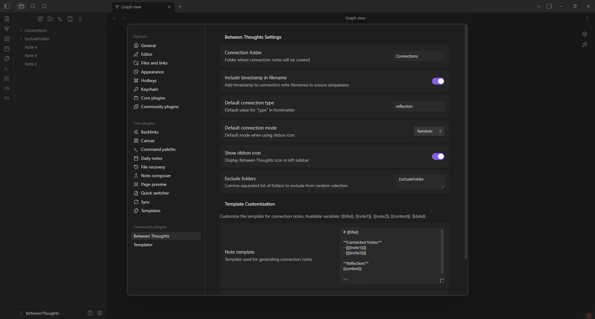
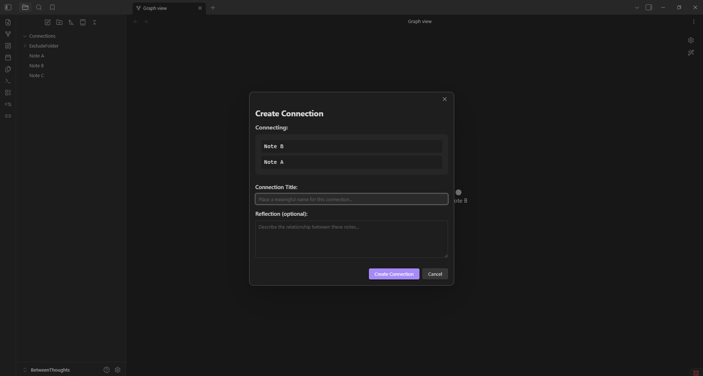
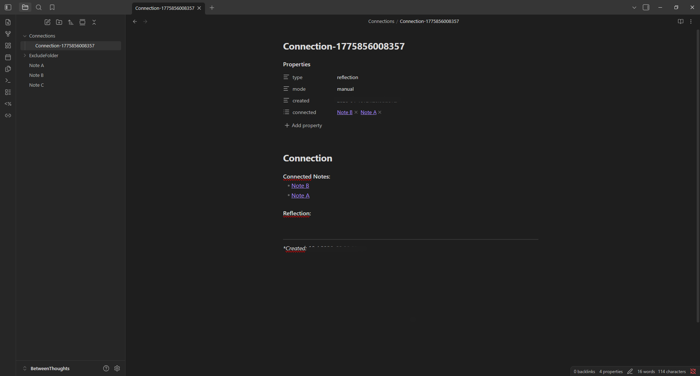

# Between Thoughts

> See connections others miss

Train creative thinking by connecting notes across your vault. Manual reflection, not automation. Understanding, not just finding.

## Table of Contents

[The Problem](#the-problem) || [The Solution](#the-solution)

[Why This Matters](#why-this-matters) || [Philosophy](#philosophy)

[Key Features](#key-features)

[Installation](#installation) || [Settings](#settings) || [Quick Start Proposal](#quick-start-proposal)

[Potential Use Cases and Examples](#potential-use-cases-and-examples)

[Feature Roadmap](#feature-roadmap)

[Contributing](#contributing)

[License](#license)

---

## The Problem

We collect thousands of notes but rarely synthesize them. AI finds connections, but do we understand them? This is the **PKM Paradox**: more collection, less comprehension.

Your vault has 5,000 notes. But how many insights do you actually have?

## The Solution

Between Thoughts pairs notes and prompts reflection. Not random chaos—**you control the scope**. Not automation—**you create the meaning**.

**Choose your mode:**
- **Random**: Unexpected pairings across your vault
- **Contextual**: Current note + another (build on your work)
- **Manual**: You pick both notes

**Control what's included:**
- Exclude specific folders (Templates, Archives, etc.)
- Focus on particular areas of your vault
- Customize for the best fit to your personal workflow

**The practice:**
1. Plugin pairs two notes
2. You pause and observe
3. You reflect: "What connects these?"
4. You write your insight
5. Connection note created

Over time, you see patterns in your thinking. You discover your cognitive style. You become the person who sees connections others miss.


---

## Why This Matters

### It's Not About the Plugin

The plugin is a tool. The value is the **practice**.

Creative thinking isn't magic - it's a skill. Like any skill:
- It requires regular practice
- It needs deliberate effort
- It builds pattern recognition
- It compounds over time

Between Thoughts is your practice tool.

### The Architecture of Thought

Think of standard wiki links as roads between cities. You travel from Note A to Note B.

**Connection notes are rest stops - adaptable according to your needs.**

On a road, you just drive across. At a rest stop, you pause. You reflect. You articulate: "Why am I traveling this route? What connects these destinations?"

**Standard links**: Technical necessity (I want to click there)
**Connection notes**: Epistemological action (I explain why they belong together)

The link is a pointer. The connection note is a **contract** that defines the relationship.

This transforms your vault from a network of streets into an **architecture of understanding**.

### Hand-in-Hand with AI

This isn't anti-AI. It's pro-understanding.

**Use AI to:**
- Find semantic connections
- Suggest related notes
- Summarize content

**Use Between Thoughts to:**
- Understand WHY connections matter
- See patterns AI misses
- Train cross-domain thinking
- Own your insights

**Both together > either alone**


> The goal isn't productivity. It's depth, meaning, and genuine creativity.

---

## Philosophy

### Why Manual?

**AI finds connections. You need to understand them.**

When you manually reflect:
- You **own** the insight (not just consume it)
- You **remember** the reasoning (not just the link)
- You **build** thinking skills (not just a database)
- You **train** pattern recognition (not just retrieve)

**This is practice, not productivity.**

### The Interface Principle

Think of standard wiki links like `void*` pointers in C++:
- They point somewhere
- But they don't explain the **type** of relationship
- They don't define the **contract** between ideas

**Between Thoughts creates interface files**, not just pointers.

**Standard Link**: A road. You drive across it to the destination.
**Connection Note**: A rest stop. You must pause and articulate WHY this road exists.

#### Header vs. Implementation

In C++, we separate **what** is done (header/interface) from **how** it's done (implementation).

- **Note A**: Describes Topic A (implementation)
- **Note B**: Describes Topic B (implementation)  
- **Connection Note**: Defines the relationship interface (header)

**Single Responsibility**: 
- Without this plugin: Note A must explain why it relates to Note B (contamination)
- With this plugin: Note A describes A. Note B describes B. Connection note carries sole responsibility for the relationship.

**Benefit**: Change your understanding of WHY they connect? Update only the interface (connection note), not the implementations (original notes).

#### Polymorphic Thinking

Interfaces can be implemented by many classes.

Example: Create a connection note called "Contradiction.md"
- Defines how two opposing ideas form synthesis
- Apply between "Capitalism" ↔ "Socialism"
- Also apply between "Light" ↔ "Shadow"
- Same **interface pattern**, different **implementations**

**The connection note becomes a template for logical relationships.**

You're not just drawing lines. You're defining **categories of thinking**.

#### Type Safety for Knowledge

Standard links: **Implicit cast** (hope it makes sense later)
Connection notes: **Explicit contract** (document the relationship now)

This elevates linking from a technical necessity ("I want to click there") to an **epistemological action** ("I explain why these belong together").

**In software terms**: You're making your knowledge graph type-safe and depth-oriented.


---

## Key Features

### Three Connection Modes

**Random Mode**
- Two unexpected notes from anywhere in vault
- Pure serendipitous discovery
- Forces unexpected juxtapositions
- "What do typography and German grammar have in common?"

**Contextual Mode**
- Current note + one other
- Build on what you're working on
- Focused exploration
- "How does this relate to my project?"

**Manual Mode** *(coming soon)*
- You choose both notes
- Follow your intuition
- Deliberate connections
- Complete control

### Control Your Scope

**Exclude Folders**
- Skip Templates, Archives, Daily Notes
- Focus only on permanent notes
- Or only on Projects + Reading
- Customize per workflow

**Example**: Exclude everything except "Projects" and "Research" to focus connections on active work.

### Flexible Output

**Plain Markdown**
- Standard `.md` files
- Frontmatter metadata
- Fully searchable
- Works with Graph View
- Works with Dataview
- Future-proof

**Customizable Templates**
- Change structure
- Add/remove sections
- Include custom metadata
- Match your system

### Privacy First

- **No external services** - Everything local
- **No data collection** - Zero telemetry
- **No tracking** - No analytics
- **Offline-first** - Works without internet
- **Open source** - Transparent code

---

## Installation

### From Community Plugins *(Recommended - Once Approved)*

1. Open Settings → Community Plugins
2. Disable Safe Mode (if needed)
3. Click Browse
4. Search "Between Thoughts"
5. Click Install, then Enable

### Manual Installation *(Available Now)*

1. Download latest release from [GitHub](https://github.com/RemoLe0/BetweenThoughts/releases)
2. Download: `main.js`, `manifest.json`, `styles.css`
3. Create folder: `<vault>/.obsidian/plugins/between-thoughts/`
4. Copy files into folder
5. Reload Obsidian (Ctrl/Cmd + R)
6. Enable in Settings → Community Plugins

### For Developers

```bash
# Clone repository
git clone https://github.com/RemoLe0/BetweenThoughts.git

# Install dependencies
npm install

# Start development mode
npm run dev

# Symlink to your vault
ln -s $(pwd) /path/to/vault/.obsidian/plugins/between-thoughts
```

---

## Settings

Access via Settings → Between Thoughts



### Connection Folder
**Default**: `Connections`

Where connection notes are created. Folder is created automatically if it doesn't exist.

### Exclude Folders
**Default**: `[]` (none)

Folders to exclude from note selection. Notes in these folders won't be paired.

**Example setup**:
```
Exclude folders:
- Templates
- Archive
- Daily Notes
```

**Result**: Only permanent notes from Projects, Reading, etc. will be paired.

### Note Template
**Default**: Standard format

Customize using template variables:
- `{{title}}` - Your connection title
- `{{note1}}` - First note name
- `{{note2}}` - Second note name
- `{{content}}` - Your reflection
- `{{date}}` - Creation timestamp

**Example custom template**:
```markdown
# {{title}}

## Notes
- [[{{note1}}]]
- [[{{note2}}]]

## Connection
{{content}}

## Next Steps
- [ ] Explore this further
- [ ] Share with team

---
*Discovered: {{date}}*
```

### Include Timestamp
**Default**: `true`

Add timestamp to filename for chronological sorting.

**Enabled**: `Connection-title-20250131-143022.md`
**Disabled**: `Connection-title.md`

### Connection Type
**Default**: `reflection`

Metadata type in frontmatter. Useful for filtering with Dataview.

**Examples**: `reflection`, `insight`, `connection`, `discovery`

### Ribbon Icon
**Default**: `true`

Show/hide chain link icon in left sidebar for quick access.


---

## Quick Start Proposal

### Your First Connection (2 Minutes)



**Step 1: Open the plugin**
- Click ribbon icon (chain link), OR
- Command Palette (Ctrl/Cmd + P) → "Create connection between random notes"

**Step 2: See two notes paired**
- Plugin shows you two note titles
- Take a moment to observe
- No rush, no pressure

**Step 3: Reflect**
- What connects these?
- Why this pairing?
- What pattern emerges?

**Step 4: Write your connection**
- **Title**: What's the connection? (required)
- **Reflection**: Why does it matter? (optional)

**Step 5: Create**
- Connection note is generated
- Saved to Connections folder
- Opens for further editing

**That's it.** You've made your first connection.



### Daily Practice (5-10 Minutes)

**Morning routine:**
- Coffee + open Obsidian
- Create one connection
- Write brief reflection
- Continue with day

**Weekly review:**
- Navigate to Connections folder
- Read week's connections
- Notice: What patterns emerge?
- Reflect: What does this reveal about how you think?

**The magic happens in the patterns.**


---

## Potential Use Cases and Examples

### Academic Research
- Connect concepts across disciplines
- Find unexpected theoretical parallels
- Build comprehensive mental models
- Synthesize literature reviews

### Creative Writing
- Link character parallels across stories
- Connect plot devices
- Build thematic depth
- Generate novel combinations

### Product Design
- Bridge user needs with technical constraints
- Connect solutions from other domains
- Find unexpected feature ideas
- Build empathy through analogy

### Personal Development
- Recognize patterns in life decisions
- Connect disparate experiences
- Build self-understanding
- Develop wisdom through reflection

### Knowledge Work
- Integrate ideas across projects
- See cross-functional solutions
- Build reputation as creative thinker
- Train pattern recognition

---

### Example 1: Random Discovery

**Notes Paired:**
- "Typography fundamentals" (Design folder)
- "German compound words" (Languages folder)

**Connection**: "Structure creates clarity"

**Reflection**: 
Both typography and language use structural rules to guide understanding. In design, whitespace and hierarchy make text readable. In German, word composition creates precise meaning. The pattern: clear structure enables clear communication.

**Outcome**: 
This insight led to redesigning our team documentation with better hierarchy. Colleagues said it was "finally readable."

---

### Example 2: Contextual Building

**Current Note**: "Product launch checklist"
**Paired With**: "Theater performance preparation" (random from vault)

**Connection**: "Launch as performance"

**Reflection**:
Theater has dress rehearsals, timing cues, audience awareness, and controlled reveals. Product launches need exactly the same: beta testing (dress rehearsal), coordinated timing (cues), user empathy (audience awareness), and staged rollout (controlled reveals).

**Outcome**:
Added "dress rehearsal week" to our launch process. Caught three major issues before public launch.

---

### Example 3: Pattern Recognition (After 3 Months)

**Analyzed 90 connection notes. Patterns emerged:**

**Pattern 1**: I connect engineering → everything (40% of connections)
- Engineering + cooking
- Engineering + relationships
- Engineering + creativity

**Pattern 2**: I think in systems and analogies (70%)
- "Like a..."
- "Similar to..."
- "The system works by..."

**Pattern 3**: I value craftsmanship over speed (recurring theme)
- Quality emerges repeatedly
- Process matters
- Shortcuts criticized

**Meta-Insight**:
Understanding my cognitive style helps me:
- Leverage strengths (systems thinking)
- Communicate better (use analogies)
- Make better decisions (prioritize quality)
- Know myself deeply

**This is the real value.** Not the connections themselves—the awareness they create.


---

## Feature Roadmap

**v0.1.0** ✅ (Current)
- Two connection modes (random, contextual, manual)
- Exclude folders
- Custom templates
- Privacy-first design

**Future Ideas** (Community-Driven)
- Include folders
- Preview option for notes while connecting
- "Reflect Later" queue
- Connection review mode
- Pattern visualization
- "Thinking spaces" for individual configurations

**No timeline.** Development driven by user feedback and maintainer's free time.

**Your input shapes the future.** [Share ideas](https://github.com/RemoLe0/BetweenThoughts/issues)

---

## Contributing

Contributions welcome! Ways to help:

**Code:**
- Fix bugs
- Improve performance
- Add features
- Refactor code

**Documentation:**
- Improve README
- Write tutorials
- Translate to other languages
- Create video guides

**Community:**
- Share your connection examples
- Answer questions in issues
- Spread the word
- Give feedback

**Process:**
1. Fork repository
2. Create feature branch
3. Make changes
4. Test thoroughly
5. Submit pull request


---

## License

MIT License - See [LICENSE](LICENSE) file for details.

---

## Final Note

This plugin stores everything as plain markdown in your vault. No external services. No internet required. No vendor lock-in.

Your notes, your connections, your insights. 

**All yours. Forever.**

---

**See connections others miss.**

[Install](https://github.com/RemoLe0/BetweenThoughts/releases) | [Documentation](https://github.com/RemoLe0/BetweenThoughts) | [Report Issue](https://github.com/RemoLe0/BetweenThoughts/issues)
